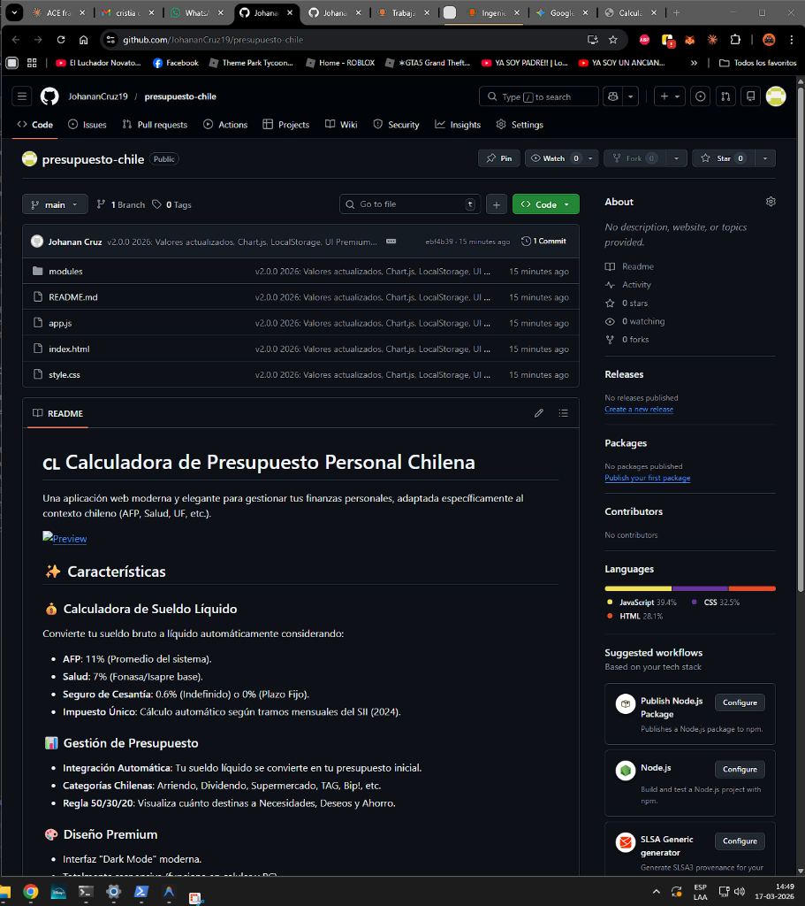

# 🇨🇱 Calculadora de Presupuesto Personal Chilena

Una aplicación web moderna y elegante para gestionar tus finanzas personales, adaptada específicamente al contexto chileno (AFP, Salud, UF, etc.).

## ✨ Características

### 💰 Calculadora de Sueldo Líquido
Convierte tu sueldo bruto a líquido automáticamente considerando:
- **AFP**: 10.77% (Promedio del sistema).
- **Salud**: 7% (Fonasa/Isapre base).
- **Seguro de Cesantía**: 0.6% (Indefinido) o 0% (Plazo Fijo).
- **Impuesto Único**: Cálculo automático según tramos mensuales del SII y valores de UF del **2026**.

### 📊 Gestión de Presupuesto
- **Integración Automática**: Tu sueldo líquido se convierte en tu presupuesto inicial.
- **Categorías Chilenas**: Arriendo, Dividendo, Supermercado, TAG, Bip!, etc.
- **Regla 50/30/20**: Visualiza cuánto destinas a Necesidades, Deseos y Ahorro.

### 🎨 Diseño Premium
- Interfaz "Dark Mode" moderna.
- Totalmente responsiva (funciona en celular y PC).
- No requiere instalación (funciona directamente en el navegador).

## 🚀 Cómo usar

1. Descarga este repositorio.
2. Abre el archivo `index.html` en tu navegador web favorito (Chrome, Edge, Firefox).
3. ¡Listo! No necesitas instalar nada más.

## 🛠️ Tecnologías

- **HTML5**
- **CSS3** (Variables, Flexbox, Grid, Dark Mode Premium)
- **JavaScript** (Vanilla ES6, LocalStorage)
- **Chart.js** (Visualizaciones analíticas 50/30/20)
- **Phosphor Icons**

---
Desarrollado con ❤️ para ayudar a ordenar las finanzas en Chile.
